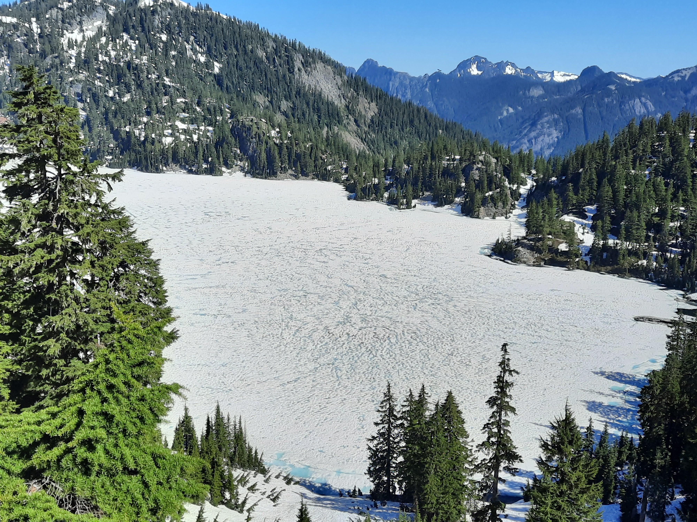

## 인터뷰 후기

4월 10일 경 부터 두 달 여를 인터뷰로 보냈다. 전 직장이었던 마이크로소프트와 페이스북. 인터뷰를 시작하게 되었던 동기를 지금 생각해 보자면,
*  

## 8월의 크리스마스
_2021/6/26_

아마존 프라임에 8월의 크리스마스가.

1998년 영화다. IMF가 시작되었을 때인가 그 전 인가. 심은하는 싱그럽고 한석규도 그 때의 그 한석규다. 지금 보니 빛이 예쁘다. 왜 지금은 한국을 가도 저런 빛을 볼 수 없을까. 미닫이 문으로 스며드는 빛. 한 낯 대청 마루에 내리는 빛. 

 

사랑을 가진 채 떠난...

 
 
 

2021년. 

사진도 사라지고 유툽과 틱톡이 그 자리를 차지한 세상.
나는 어떻게 하면 물건 하나 더 팔까 고민하는 아마존 Advertising 팀에서 월급 받아 먹고 있다.
자본주의의 노예.

...

치고는 벌이가 괜찮다.
그래서 계속 자본주의의 노예.

 
 

## 발목을 접지름

_2021/6/26_

올 해 첫 하이킹.

지난 4, 5월을 인터뷰 준비하느라 다 소모하고 (다 떨어졌기 때문에 체력, 정신은 소모하고 시간은 허비해 버린). 7월이 되서야 나선 스노우 레이크 트레일. 내려오는 길에 눈을 피해 점프하다 왼쪽 발목을 접질렀다. 인대가 늘어 났거나 뼈가 어떻게 된 것 같지는 않지만 회복 되려면 한 두 주 걸릴 듯. 가지고 간 스틱을 썼어야 되는데 왜 때문인지 과신함.

사진은 7월이 코 앞인데 아직 얼어 있는 Snow Lake. 저 얼음이 녹으면 에메랄드 빛의 호수를 볼 수 있는데. 그건 보지 못하고 뉴욕으로 날아가게 될 듯.

올 해 첫 하이킹에서 발목을 접지른 바람에 이게 시애틀에서 처음이자 마지막이 된 하이킹.

 
 

 <a href='https://free-hit-counters.net/'>FREE Hit Counters</a> 

